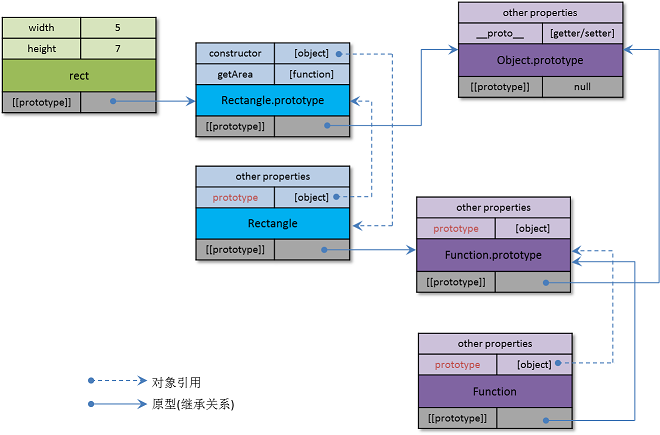

# 构造函数

根据前面所讲的，我们知道构造函数是一个希望在调用时加上new关键字的函数，它的作用主要有两个：

- 创建一个新的对象
- 为要创建的对象构造原型对象，并将新创建的对象与其原型对象关联起来

## new关键字的作用

如此可见，这个new关键字对于构造函数而言非常关键。那么这个new究竟起了什么作用呢？

比如下面的Rectangle这个构造函数：

```javascript
var Rectangle = function(width, height) {
	this.width = width;
	this.height = height;
};

// 在 Rectangle.prototype 对象中添加一个属性“getArea”，该属性的值为一个函数
Rectangle.prototype.getArea = function() {
	return this.width * this.height;
};

// 生成一个rect对象
// 该rect对象拥有两个属性（width和height）和一个方法（getArea）
var rect = new Rectangle(5, 7);

console.log(rect.getArea());  // 35
```

从以上代码上看，这个Rectangle非常像一个类，而rect对象是Rectangle类的一个实例。这也是为什么使用构造函数的这种方式被Douglas Crockford称为“伪类模式”（pseudoclassical pattern）的原因。

估计这主要是由于基于类的编程方式太流行了，JavaScript的开发者们为了争取更多的使用者而这样设计的。在很多文章中，也如此解释这个构造函数。当实际上这是不正确的，我们必须要从基于原型的思想来理解这个构造函数，这样才不会用着用着就出现哪不对的情况。

当new这个关键字出现在函数调用的前面时，实际上是在告诉JavaScript引擎这是一个构造函数的调用。而JavaScript引擎就会隐含地对被调用函数进行一些修改，比如Rectangle()函数在运行时将会被修改为：

```javascript
var Rectangle = function(width, height) {
  // Create a new object with hidden link to Rectangle.prototype
  // var obj = Object.create(Rectangle.prototype);

  // Set “this” variable to the newly created object
  // this = obj;

  // Execute original code
  this.width = width;
  this.height = height;

  // return this;
};
```

正如上面的注释，当加上new以后，就如同给函数加入了一些步骤，从而变成：

1. 以Rectangle.prototype为原型创建一个新对象，作为要返回的对象
2. 将新创建的对象赋给this变量，也就是所说的把this绑定到该对象上
3. 执行原有的函数代码
4. 返回this所指向的对象

正如在[《JavaScript的面向对象编程实现方式》](class-prototype-oop.md)一章中提到的，构造函数应该被理解为一个制造对象的加工工厂，为要创建的对象准备了一个原型对象（即prototype属性的值）。

注意，这个prototype属性是任意一个函数都默认具有的属性，它是在函数被用作构造函数时才会被用到的。这个prototype属性并不是构造函数本身的原型对象，而是要新创建的对象的原型对象。

## 继承关系

这有一点绕，让我们用一个图来表示这里的继承关系：



从图中我们可以看到：

- 从继承关系上看，rect与Rectangle并没有任何关系；原型链为： rect -> Rectangle.prototype -> Object.prototype

- 图中有三个构造函数：Rectangle、Function、Object
	- prototype是构造函数对象中的一个属性；prototype属性所指向的对象，就是所有被此构造函数所创建的对象的原型对象
	- 三个构造函数的原型对象都是Function.prototype
	- 最容易混淆的是Object对象，常常将其误理解为所有对象的“基类”或者祖先，实际上它只是一个用来创建新对象的构造函数

- Object.prototype对象没有原型对象，一般来说它就是原型链的终点

- Function对象的原型对象都是Function.prototype，这有一点特殊。这是因为：
	-	Function对象也是一个构造函数，其目的是创建其它的函数对象，并为它们提供了一个原型对象Function.prototype
	-	Function对象本身也是一个函数对象，所以它本身应该继承于Function.prototype对象

- Function.prototype对象是所有函数对象的原型对象，它本身的原型对象是Object.prototype

让我们看一下Function.prototype对象具有的属性：

	> Object.getOwnPropertyNames(Function.prototype);
	[ 'length',
	  'name',
	  'arguments',
	  'caller',
	  'apply',
	  'bind',
	  'call',
	  'toString',
	  'constructor' ]

这里有我们熟悉的arguments、apply、call等属性，这些属性就是函数所具有的属性。

## 函数的调用

讲到这里，我们来到了函数的原型对象Function.prototype。在JavaScript代码中，当我们调用一个函数时，可以理解为下面的调用：

	Function.prototype.call (thisArg [ , arg1 [ , arg2, … ] ] )

第一个参数就是this，后面的是参数列表。this就是一个名叫this的变量，仅此而已。由于JavaScript的作用域是在函数体中，在各函数中的this具体是什么值，需要根据不同的函数调用方式在运行时才能确定。这就是我们接下来要在[《this解密》](the-secret-of-this.md)所讲的内容。