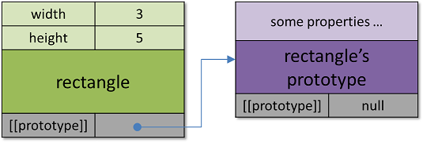
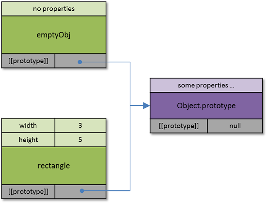

# JavaScript中的原型实现

假设你对基于原型的面向对象编程方式有了一定的了解（如果没有，请参看[《JavaScript的面向对象编程实现方式》](class-prototype-oop.md)），也知道了继承就是通过原型来实现的。

那么具体在JavaScript语言中，这是如何实现的呢？

为了从根本上弄清楚JavaScript的原型，我们追本溯源，从ECMAScript规范说起。

## 对象的内部方法和内部状态位

在ECMAScript规范中，对象拥有内部方法（internal methods）和内部状态位（internal slots）。

- 内部方法是对象在运行时刻的一些行为。

- 内部状态位（internal slot）用于记录对象的各种内部状态，可以将其想像为对象的内部属性。**但内部状态位不是对象的属性，也不能够被继承**。这些内部状态位的值可以是在ECMAScript规范中定义的任何数据类型。

可以看到，这样的对象（拥有状态与方法）就是面向对象概念中的对象。不过要注意的是，在这里ECMAScript是针对JavaScript引擎的要求，而不是在编程语言层面的定义。所以说是内部的，是因为这些是要求JavaScript引擎必须要支持的，但是对于使用JavaScript语言的编程人员来说是不可见的。

为了一眼能看出来，ECMAScript规范中使用双方括号“[[]]”来进行明确标识内部方法和内部状态位。下面的一个内部状态位和一个内部方法是实现原型继承的关键：

- [[prototype]]是一个内部状态位，它的值要么是null，要么指向当前对象的原型对象；所有的普通类型对象都有这个内部状态位；

- [[GetPrototypeOf]]是一个内部方法，该方法返回为当前对象提供继承属性的对象，也就是当前对象的原型对象；如果没有原型对象，返回null；实际上，该方法就是返回当前对象的内部状态位[[prototype]]的值。

通过内部状态位[[prototype]]，JavaScript引擎得知对象的原型对象，从而也就提供了基于原型方式下的继承实现方法。前面提到的原型链也是通过内部状态位[[prototype]]来实现的。

我们可以使用一个图来表示对象的内存映象和继承关系，图中对象名称的上方是对象的属性（对JavaScript编程人员可见），而对象名称的下方是内部状态位（对JavaScript编程人员不可见），内部状态位[[prototype]]指向原型对象。比如下面这个对象：

```javascript
// 使用源文本方式创建一个对象，该对象有两个属性
var rectangle = {
	width: 3,
	height: 5
};
```

用图形表示为：



为了简化，这里仅列出了一个内部状态位，即[[prototype]]。对象rectangle的原型对象的[[prototype]]为null，这代表没有原型对象，是原型链的终点。

为了得到对象的原型对象，JavaScript提供了**Object.getPrototypeOf()**这个方法。这个方法实际上会调用内部方法[[GetPrototypeOf]]，最终返回的就是[[prototype]]内部状态位。


## 使用源文本创建的对象

就像我们在[《对象的创建》](how-to-create-objects.md)中讲到的，上面rectangle对象是使用源文本方式创建的，这也是最直接简单的方法。那么使用源文本方式创建的对象有没有原型对象呢？让我们来看一下：

```javascript
var emptyObj = {}; // An object with no properties

Object.getPrototypeOf(emptyObj) === Object.prototype; // true

Object.getPrototypeOf(rectangle) === Object.prototype; // true
```

从上面的例子可以看到，两个以源文本方式创建的对象emptyObj和rectangle的原型对象都是**Object.prototype**。

实际上在JavaScript中，以源文本创建的对象，其默认就是以Object.prototype为原型对象，也可以说继承了Object.prototype。所以emptyObj和rectangle都可以使用Object.prototype对象的属性，比如：

```javascript
emptyObj.toString();  // [object Object]
rectangle.toString();  // [object Object]
```

在一般情况下，新创建的对象都直接或间接地继承了Object.prototype这个对象，也就继承了其属性。基于这个原因，我们说在JavaScript中很少有真正意义上的空对象。

从上面的例子可以看到，当JavaScript在访问一个对象的属性时（比如上面rectangle.toString属性，注意该属性的值是一个函数），如果当前对象没有该属性（rectangle对象本身并没有toString），JavaScript引擎就会尝试去搜索该对象的原型对象，如果找到了就使用该属性；如果没有找到，就再尝试在原型对象的原型对象中查找，一直到没有原型对象为止。这样通过一级一级的将原型对象链接的方式就叫**“原型链”**。注意，这样一级一级地搜寻原型链是会带来性能上的消耗的，如果继承层次很多，而且经常要查找整个原型链，那可能会导致整体性能上的问题。

## Object.prototype对象

上面提到的Object.prototype对象是JavaScript内置的一个对象。需要注意的是，虽然我们将其称为Object.prototype对象，实际上prototype是Object的一个属性，JavaScript将这个内置对象赋值给Object.prototype。

这个对象（Object.prototype）具备了一些基本的属性，比如toString()和valueOf()，JavaScript希望新建的对象都直接或间接地以Object.prototype对象为原型对象，也就是直接或间接地继承Object.prototype对象。

另外，Object.prototype对象是少有的没有原型对象的对象。

	// 列出Object.prototype对象自身的属性
	Object.getOwnPropertyNames(Object.prototype);
		[ 'constructor',
	  	  'toString',
	      'toLocaleString',
	      'valueOf',
	      'hasOwnProperty',
	      'isPrototypeOf',
	      'propertyIsEnumerable',
	      '__defineGetter__',
	      '__lookupGetter__',
	      '__defineSetter__',
	      '__lookupSetter__',
	      '__proto__' ]

	// Object.prototype对象没有原型对象，也就是说该对象的内部状态位[[prototype]]的值为null
	Object.getPrototypeOf(Object.prototype) === null;  // true

对于前面使用源文本方式创建的emptyObj和rectange对象，其继承关系可以如下图表示（注意Object.prototype是原型链的终点，因为它没有原型对象了）：



在Object.prototype对象的属性中，你一定会注意到\_\_proto\_\_这个属性了吧？那让我们来深入地看看这个属性。

## \_\_proto\_\_属性

### \_\_proto\_\_的由来

\_\_proto\_\_属性最早是在Mozilla的两个JavaScript引擎中引入的，这两个引擎是SpiderMonkey和Rhino。SpiderMonkey是Firefox浏览器中的JavaScript引擎。后来，主流的浏览器在其JavaScript引擎中都支持了这个属性。

你也应该注意到前后的双下划线了吧，这种命名方式在ECMASCript规范中并没有明确定义。有各种不同的说法，我觉得可取的有两种：

1. 用双下划线表明这是一个非标准的属性，使用时需要注意；
2. 通过双下划线来避免系统定义的名称与用户定义的名称发生冲突。

由于\_\_proto\_\_得到了广泛的支持，在ECMASCript 6中决定对其进行了标准化。但是由于对这个属性的使用上经常发生问题，ECMASCript规范并不推荐使用\_\_proto\_\_，所以在ES 6中将其作为一个不赞成使用的功能（deprecated feature）加入进来，并且仅对网络浏览器有此要求。如果你想看一下规范原文，可以查看附录[B.2.2](http://www.ecma-international.org/ecma-262/6.0/#sec-additional-properties-of-the-object.prototype-object)和[B.3.1](http://www.ecma-international.org/ecma-262/6.0/#sec-__proto__-property-names-in-object-initializers)。

### 对\_\_proto\_\_的误解

对于\_\_proto\_\_，网上有不少的文章对其进行了讲解，下面是我们经常看见的一个图：


这张图来自于[这篇文章](http://dmitrysoshnikov.com/ecmascript/javascript-the-core/)，其中的解释是“*we have the structure with two explicit own properties and one implicit \_\_proto\_\_ property, which is the reference to the prototype of foo*”。

很多的文章就和这里的理解一样，认为\_\_proto\_\_属性就是指向当前对象的原型对象。让我们基于这种理解来做一个试验：

```javascript
var objPoint = {x: 1, y: 2};  // 使用源文本方式创建一个新对象objPoint，自身带有两个属性

console.log(objPoint); // { x: 1, y: 2}

Object.getPrototypeOf(objPoint) === Object.prototype;  // true，对象objPoint的原型对象是Object.prototype
objPoint.__proto__ === Object.prototype;  // true，访问__proto__也得到objPoint的原型对象，看起来确实是指向原型对象

// 接下来，我们尝试通过__proto__属性来修改objPoint的原型对象

objPoint.__proto__ = null;  // 把__proto__设为null，希望把objPoint改为没有原型对象，也就是不继承任何对象

Object.getPrototypeOf(objPoint) === null; // true，成功，objPoint确实没有原型对象了

objPoint.__proto__ === null;  // false，咦，objPoint不是已经没有原型对象了嘛？为什么objPoint的__proto__的值不是null，那是什么？

objPoint.__proto__ === undefined; // true，__proto__不在对象objPoint中存在，怎么回事？

// 好像出了点问题，我想把objPoint再改回去，也就是从Object.prototype继承

objPoint.__proto__ = Object.prototype;  // 希望能通过__proto__属性，再链接到Object.prototype对象上

Object.getPrototypeOf(objPoint) === Object.prototype; // false，怎么回事？上面不是把__proto__指向Object.prototype了嘛？

// 我们来看看这时的objPoint变成什么样了

console.log(objPoint); // { x: 1, y: 2, __proto__: {} }
```

为什么，上面的objPoint对象里面出现了一个\_\_proto\_\_属性了呢？为什么通过改变\_\_proto\_\_的值，无法改变原型对象了呢？

### \_\_proto\_\_真相

这是因为：

1. 属性\_\_proto\_\_不是每个对象（比如上面例子中的objPoint）的属性，它是Object.prototype对象的属性；
2. 属性\_\_proto\_\_不是一个普通的属性，它是一类特殊的属性，叫作访问属性（accessor property）。

首先，属性\_\_proto\_\_存在于Object.prototype对象中。让我们不厌其烦地再看一下Object.prototype自身所拥有的属性：

	// 列出Object.prototype对象自身的属性
	Object.getOwnPropertyNames(Object.prototype);
		[ 'constructor',
	  	  'toString',
	      'toLocaleString',
	      'valueOf',
	      'hasOwnProperty',
	      'isPrototypeOf',
	      'propertyIsEnumerable',
	      '__defineGetter__',
	      '__lookupGetter__',
	      '__defineSetter__',
	      '__lookupSetter__',
	      '__proto__' ]

看到了嘛？最后一个属性就是\_\_proto\_\_。在修改objPoint的原型对象之前，对__proto__的访问实际上通过原型链访问了Object.prototype的\_\_proto\_\_。

在JavaScript中，如果没有特别地更改一个对象的原型对象，一般情况下对象都是直接或者间接地继承了Object.prototype对象，所以都可以使用这个\_\_proto\_\_属性。

如果都是访问Object.prototype的\_\_proto\_\_属性，那它就应该返回的是Object.protototype对象的原型对象呀？而且前面讲过，Object.prototype并没有原型对象。

这就是上面的第二条，\_\_proto\_\_是一种叫作访问属性（accessor property）的属性。

### 访问属性 （accessor property）

这里就引入了一个新的话题，在JavaScript中，对象的属性实际上有两种：

1. 第一种叫作数据属性（data property），这就是我们常见的属性，属性的值是某种数据类型；
2. 第二种叫作访问属性（accessor property），它的值被替换为一个或两个方法：getter和setter。

当访问一个访问属性时，getter方法将会被调用（没有传入参数），该getter方法返回的值就成为访问该属性的值。

当给一个访问属性赋值时，setter方法将会被调用。

如果一个访问属性只有getter方法，可以说这是一个只读的属性；如果具有getter和setter两个方法，那么可以说这是一个可读可写的属性。

在对象中，定义一个访问属性最简单的方法就是使用源文本方式，语法如下：

```javascript
var o = {
	// 普通的数据属性
	dataProperty: value,

	// 可读写的访问属性，有getter和setter
	get accessorProperty() { /* function body here */ },
	set accessorProperty(value) { /* function body here */ }
};
```

一个简单的例子：

```javascript
// 创建一个带有访问属性的对象
var obj = {
	// 两个普通的数据属性
	x: 1,
	y: 2,

	// 一个只读的访问属性，返回属性x与属性y的乘积
	get a1() { return (this.x * this.y); },

	// 一个可读写的访问属性，返回属性x与属性y的和
	get a2() { return (this.x + this.y); },
	set a2(point) {
		this.x = point.x;
		this.y = point.y;
	}
};

// 使用这些访问属性
console.log(obj.a1);  // 2

console.log(obj.a2);  // 3

obj.a2 = { x: 5, y: 11 };  // 使用setter方法修改obj的两个属性x和y

console.(obj); // { x: 5, y: 11, a1: [Getter], a2: [Getter/Setter] }

console.log(obj.a1);  // 55
```

为了简单起见，上面访问属性a2的setter方法中并没有对输入参数作检验，这里只是为了演示setter的用法。随便提一下，setter方法仅允许有一个参数。

在我们前面的例子中，当我们想把没有原型对象的objPoint，尝试通过修改\_\_proto\_\_属性重新建立和Object.prototype的链接时，却发现\_\_proto\_\_成了objPoint对象的一个普通属性。我们下面通过代码解释这是为什么：

```javascript
// 新创建的objPoint对象是继承于Object.prototype
// 下面将__proto__赋值为null，实际上是调用了__proto__的setter方法
// 该方法将objPoint对象的内部状态位[[prototype]]设置为null，由此objPoint就没有原型对象了
objPoint.__proto__ = null;

// objPoint不从Object.prototype继承属性，当然也就是没有了__proto__属性，所以是undefined
objPoint.__proto__ === undefnined;

// 这个赋值操作实际上是在objPoint对象上新创建了一个普通的数据属性，名为__proto__
// 这并没有改变objPoint的内部状态位[[prototype]]，也就没有改变其原型对象
objPoint.__proto___ = Object.prototype;

// 所以，你将会在objPoint中看到__proto__这个属性，它仅仅只是一个普通属性而已，与x、y没什么区别
console.log(objPoint); // { x: 1, y: 2, __proto__: {} }

// 而且，objPoint的原型对象仍然为null，即没有
Object.getPrototypeOf(objPoint) === null;
```

### \_\_proto\_\_小结

1. \_\_proto\_\_是Object.prototype对象中的一个访问属性

2. 可以通过\_\_proto\_\_属性来获取或者改变对象的原型对象，前提是必须直接或间接地继承于Object.prototype对象

3. 对\_\_proto\_\_的访问会带来原型链的搜索，有时可能会导致严重的性能问题，所以不建议使用这个属性

4. 在需要访问对象的原型对象时，建议使用Object.getPrototypeOf()方法，该方法会直接返回内部状态位[[prototype]]，没有性能上的隐患

5. 使用\_\_proto\_\_存在兼容性上的隐患，即便是在ES 6规范中，也只定义了网络浏览器的JavaScript引擎要支持这个属性

6. 尽量不要动态去修改一个对象的原型对象，这是一个非常慢的操作，可能会带来性能上的问题；尽量在创建对象时，使用Object.create()方法指定对象的原型对象

7. 在最近的ES 6草案中引入了Object.setPrototypeOf()方法，其目的也是为了避免使用\_\_proto\_\_属性

8. ESLint检测：[no-proto规则](http://eslint.org/docs/rules/no-proto)

## 原型小结

JavaScript采用了基于原型的面向对象编程方式，但是其对原型的支持是在JavaScript引擎内部，通过内部状态位[[prototype]]和相关的内部方法来实现的。而呈现给JavaScript编程人员的，却是一个object类型（键值对），还有我们即将看到的“伪类模式”的[构造函数](constructor.md)。

通过对原型在JavaScript中实现的深入理解，将会帮助我们在编写面向对象的JavaScript程序时保持清晰的头脑。
